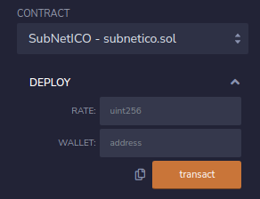
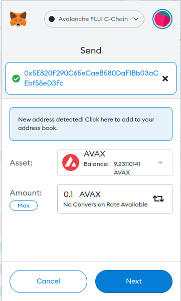
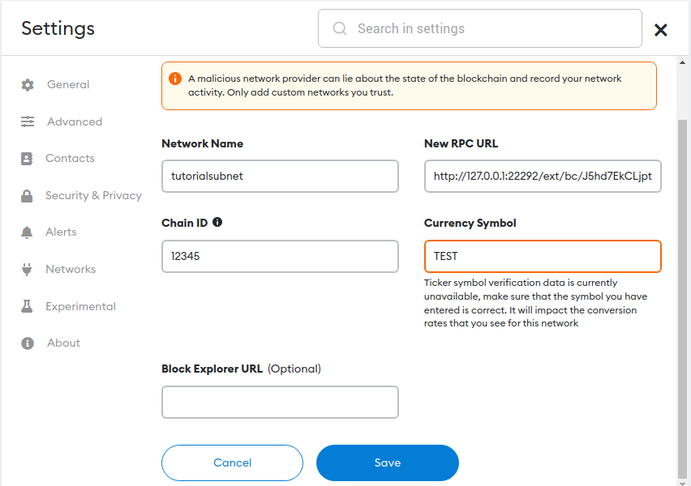
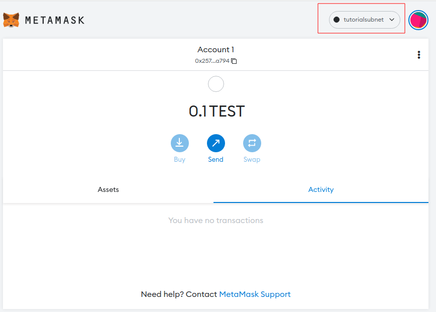
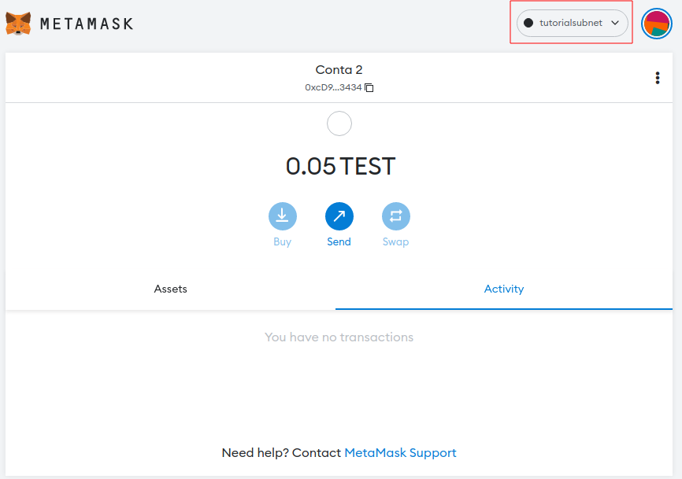

# Doing a ICO for subnet native token

This tutorial will explain how you can do a simple ICO (initial coin offer) for your subset native token. 

Once you create a subnet for a specific purpose, this network can have its native token. You may need to find a way to distribute these native tokens. We will implement a way to distribute the initial native tokens of your subnet through an ICO contract, so people can interact with the contract to buy your native token before you deploy your subnet.

We will divide into two parts:

1. Create a contact in the avalanche network for users to buy subnet native coin
2. Deploy subnet in with custom genesis block specifying the token distribution

You will need some basic knowledge about: 

- Solidity
- Python

## 1. Create a contact in avalanche network for user buy subnet native coin

The first thing we need to do is set up a way for a particular person to buy your native coins. For this we'll deploy a contract in solidity contract in Avalanche with a function for buying a token, any person can interact with this contract and buy the tokens.

Our contract is based on [OpenZeppelin Crowdsale contract](https://github.com/OpenZeppelin/openzeppelin-contracts/blob/release-v2.5.0/contracts/crowdsale/Crowdsale.sol). In the original crowdsale contract the user sends some AVAX to the contract and the contract gives back some ERC20 tokens. But in our case, we won't give ERC20 tokens, but just log that the user sends some AVAX. Then when we deploy our subnet we gonna use this information to distribute the initial native tokens.

Contract code:
```javascript
pragma solidity ^0.5.0;

import "https://github.com/OpenZeppelin/openzeppelin-contracts/blob/release-v2.5.0/contracts/GSN/Context.sol";
import "https://github.com/OpenZeppelin/openzeppelin-contracts/blob/release-v2.5.0/contracts/math/SafeMath.sol";
import "https://github.com/OpenZeppelin/openzeppelin-contracts/blob/release-v2.5.0/contracts/utils/ReentrancyGuard.sol";

contract SubNetICO is Context, ReentrancyGuard{
    using SafeMath for uint256;

    // How many token units a buyer gets per wei.
    uint256 private _rate;

    // Address where funds are collected
    address payable private _wallet;

    // List buyers 
    mapping(uint32 => address) private _buyers;

    // Map buyer address and how much he/she bought 
    mapping(address => uint256) private _buyers_values;

    // Control buyer index variable
    uint32 private _buyer_index;

    /**
     * Contract constructor
     * @param rate Number of token units a buyer gets per wei. The rate is the conversion between wei and the smallest and indivisible
     * token unit.
     * @param wallet Address where collected funds will be forwarded to
     */
    constructor (uint256 rate, address payable wallet) public {
        require(rate > 0, "Crowdsale: rate is 0");
        require(wallet != address(0), "Crowdsale: wallet is the zero address");

        _buyer_index = 0;
        _rate = rate;
        _wallet = wallet;
    }

    /**
     * This function is called every time the contract receive a transaction
     */
    function () external payable {
        buyTokens(_msgSender());
    }

    /**
     * Buy the tokens. Add the beneficiary in _buyers map in the current _buyer_index position.
     * Register the transaction value in _buyers_values 
     * @param beneficiary Address performing the token purchase
     */
    function buyTokens(address beneficiary) public nonReentrant payable {
        uint256 weiAmount = msg.value;
        _preValidatePurchase(beneficiary, weiAmount);

        // calculate token amount to be created
        uint256 tokens = _getTokenAmount(weiAmount);

        _buyers[_buyer_index] = beneficiary;
        _buyers_values[beneficiary] = tokens;
        _buyer_index += 1;

        _forwardFunds();
    }

    /**
     * Validation of an incoming purchase. Use require statements to revert state when conditions are not met.
     * @param beneficiary Address performing the token purchase
     * @param weiAmount Value in wei involved in the purchase
     */
    function _preValidatePurchase(address beneficiary, uint256 weiAmount) internal view {
        require(beneficiary != address(0), "Crowdsale: beneficiary is the zero address");
        require(weiAmount != 0, "Crowdsale: weiAmount is 0");
        this; // silence state mutability warning without generating bytecode - see https://github.com/ethereum/solidity/issues/2691
    }

    /**
     * @param weiAmount Value in wei to be converted into tokens
     * @return Number of tokens that can be purchased with the specified _weiAmount
     */
    function _getTokenAmount(uint256 weiAmount) internal view returns (uint256) {
        return weiAmount.mul(_rate);
    }

    /**
     * Determines how ETH is stored/forwarded on purchases.
     */
    function _forwardFunds() internal {
        _wallet.transfer(msg.value);
    }

    /**
     * Return a buyer address given a index
     * @param index Index for buyer address
     */
    function getBuyerAddress(uint32 index) public view returns (address) {
        return _buyers[index];
    }

    /**
     * Return a buyer value given a address
     * @param buyer_address Buyer address
     */
    function getBuyerValue(address buyer_address) public view returns (uint256) {
        return _buyers_values[buyer_address];
    }

}
```

Everytime someone sends some AVAX to this contract it will call the function `buyTokens(_msgSender())`. Where `_msgSender()` is the sender address. The `buyTokens` function will first calculate the amount of subnet native tokens it needs to reserve for the sender, this value is the amount of AVAX (or wei) times `_rate`. If  `_rate` is 2 for example it will multiply the amount of AVAX the user sent to the contract times 2. 

The next step is to log the sender's address and the number of native tokens he/she will receive. This is done by:

```javascript
_buyers[_buyer_index] = beneficiary;
_buyers_values[beneficiary] = tokens;
```

Now we increase the `_buyer_index`, so the next buyer will be logged in index 1. Remember that the user sent AVAX to the contract? We gonna transfer this AVAX from the contract to the contract owner.`_wallet` should be the contract owner's address.

Finally, deploy the contract to Avalanche FUJI Testnet. You can find a tutorial on how to do this using Remix and Metamask at: https://docs.avax.network/dapps/smart-contracts/deploy-a-smart-contract-on-avalanche-using-remix-and-metamask. Remember to set the compiler to 0.5.0. When you deploy the contract you also need to specify the rate (`_rate` variable) and owner address (`_wallet` variable), as shown in the figure below.



After deployment, you can just send some AVAX to the contract address and the contract will log the number of native subnet tokens you will receive. For example my contract address is `0x5E820F290C65eCaeB580DaF1Bb03aCEbf58eD3Fc` so i will send 0.1 AVAX and 0.05 from two different wallets.



You can see this transactions on testnet.snowtrace: https://testnet.snowtrace.io/address/0x5e820f290c65ecaeb580daf1bb03acebf58ed3fc

## 2. Deploy subnet in with custom genesis block specifying the token distribution

Our contract now has logged everyone that decides to buy our native token. Now we need to interact with it to discover these people's addresses and how much AVAX they sent. Using this information we can create a custom genesis block that specifies native token distribution. To interact with the contract, we gonna use [python library Web3.py](https://web3py.readthedocs.io/en/stable/)

First we need to define a function to return the contract as a object wich we can interact. Function code:

```python
def get_contract(avax_net, contract_address, abi_file):
    web3 = Web3(Web3.HTTPProvider(avax_net))
    web3.middleware_onion.inject(geth_poa_middleware, layer=0)
    with open(abi_file) as json_file:
        abi = json.load(json_file)
    contract_address_sum = web3.toChecksumAddress(contract_address)
    contract = web3.eth.contract(address=contract_address_sum, abi=abi)
    return contract
```

This function will return our contract as an object so we can interact with it. It has 3 parameters. The first is the network RPC URL, which can be found in: https://docs.avax.network/dapps/smart-contracts/deploy-a-smart-contract-on-avalanche-using-remix-and-metamask#step-1-setting-up-metamask. Second is the contract address. In our case it will be the `0x5E820F290C65eCaeB580DaF1Bb03aCEbf58eD3Fc`. And the last one is a JSON file that contains the contract ABI. You can find the contract ABI in the Remix IDE and just copy and paste into a file.

Now we can call some functions of the contract. If you look at contract code it have to `get` functions: `getBuyerAddress(uint32 index)` and `getBuyerValue(address buyer_address)`. We gonna use these functions to read the buyer's address and values. To do this, first, we call `getBuyerAddress(0)` and get the address of the first buyer (index 0), then using this address we call `getBuyerValue(buyer_address)` to get the amount of native token this address will receive. Now we do the same thing for the second buyer (`getBuyerAddress(1)`), and so on. When the buyers list is finished the `getBuyerAddress` will return the address `0x0000000000000000000000000000000000000000` and we gonna stop the iteration. Code for this:

```python
def read_buyers(contract):
    buyers = []
    index_buyer = 0
    while True:
        buyer_address = contract.functions.getBuyerAddress(index_buyer).call()
        if int(buyer_address, 0) == 0:
            break
        buyer_value = contract.functions.getBuyerValue(buyer_address).call()
        buyers.append((buyer_address, buyer_value))
        index_buyer += 1
    return buyers
```

The `read_buyers` returns a list of tuples with: (buyer address, buyer receive value). We gonna use this list to fill the genesis block. You can find all parameters for the genesis block in: https://docs.avax.network/subnets/customize-a-subnet#genesis. But we gonna focus on "alloc" parameter (https://docs.avax.network/subnets/customize-a-subnet#setting-the-genesis-allocation). This parameter control initial native token allocation. To specify the allocation you need to follow the patern:

```json
  "alloc": {
    "#ADDRESS_1": {
      "balance": "#BALANCE_HEX"
    },
    "ADDRESS_2": {
      "balance": "#BALANCE_HEX"
    }
    ...
  },
```

For example:

```JSON
  "alloc": {
    "8db97C7cEcE249c2b98bDC0226Cc4C2A57BF52FC": {
      "balance": "0x52B7D2DCC80CD2E4000000"
    },
    "Ab5801a7D398351b8bE11C439e05C5B3259aeC9B": {
      "balance": "0xa796504b1cb5a7c0000"
    },
    "257Af7874722c2087F57f616dBFc57F7Ece7a794": {
      "balance": "0xa796504b1cb5a7c0000"
    }
  },
```

As you can see, the addresses should are without the canonical 0x prefix and the balance is in hexdecimal.

To finish our tutorial we need to read the buyers address and values and write then in the `alloc` parameter. Since the `alloc` is the only parameter we gonna change, we can start from a [base genesis block](https://docs.avax.network/subnets/customize-a-subnet#genesis) and only modify the `alloc`. So our code will be:


```python
base_genesis_file = "genesis_base.json"
output_custom_genesis = "custom_genesis.json"
network_url = "https://api.avax-test.network/ext/bc/C/rpc"
contract_address = "0x5e820f290c65ecaeb580daf1bb03acebf58ed3fc"
abi_file = "abi.json"

contract = get_contract(network_url, contract_address, abi_file)
buyers = read_buyers(contract)
with open(base_genesis_file) as json_file:
    base_genesis = json.load(json_file)

new_alloc = {}
for buyer_address, buyer_value in buyers:
    new_alloc[buyer_address[2:]] = {"balance" : hex(buyer_value)}

base_genesis["alloc"] = new_alloc

with open(output_custom_genesis, 'w') as f:
    json.dump(base_genesis, f)
```

The final script is:

```python
import json

from web3 import Web3
from web3.middleware import geth_poa_middleware

def get_contract(avax_net, contract_address, abi_file):
    web3 = Web3(Web3.HTTPProvider(avax_net))
    web3.middleware_onion.inject(geth_poa_middleware, layer=0)
    with open(abi_file) as json_file:
        abi = json.load(json_file)
    contract_address_sum = web3.toChecksumAddress(contract_address)
    contract = web3.eth.contract(address=contract_address_sum, abi=abi)
    return contract

def read_buyers(contract):
    buyers = []
    index_buyer = 0
    while True:
        buyer_address = contract.functions.getBuyerAddress(index_buyer).call()
        if int(buyer_address, 0) == 0:
            break
        buyer_value = contract.functions.getBuyerValue(buyer_address).call()
        buyers.append((buyer_address, buyer_value))
        index_buyer += 1
    return buyers

if __name__ == "__main__":
    base_genesis_file = "genesis_base.json"
    output_custom_genesis = "custom_genesis.json"
    network_url = "https://api.avax-test.network/ext/bc/C/rpc"
    contract_address = "0x5e820f290c65ecaeb580daf1bb03acebf58ed3fc"
    abi_file = "abi.json"

    contract = get_contract(network_url, contract_address, abi_file)
    buyers = read_buyers(contract)
    with open(base_genesis_file) as json_file:
        base_genesis = json.load(json_file)
    
    new_alloc = {}
    for buyer_address, buyer_value in buyers:
        new_alloc[buyer_address[2:]] = {"balance" : hex(buyer_value)}

    base_genesis["alloc"] = new_alloc

    with open(output_custom_genesis, 'w') as f:
        json.dump(base_genesis, f)
    
```

This script will output our custom genesis file with the name `custom_genesis.json`, with the inital native token balances filled acording how send AVAX to the contract.

Lets create our subnet using this custom genesis file. We gonna use [avalanche-cli](https://github.com/ava-labs/avalanche-cli) to create our subnet. Instalation steps can be found in: https://docs.avax.network/subnets/create-a-local-subnet. 

To create the subnet use:

```sh
avalanche subnet create <subnetName> --file `custom_genesis.json`
```

Where `<subnetName>` is the name of your subnet. If prompt `What VM does your genesis use?:` select `Custom`. We can list our subnet with `avalanche subnet list`:

```sh
+----------------+----------------+----------+--------+----------+
|     SUBNET     |     CHAIN      | CHAIN ID |  TYPE  | DEPLOYED |
+----------------+----------------+----------+--------+----------+
| tutorialsubnet | tutorialsubnet |    12345 | Custom | No       |
+----------------+----------------+----------+--------+----------+
```

You can see the custom genesis file with `avalanche subnet describe <subnetName> --genesis`:

```sh
{"config": {"chainId": 12345, "homesteadBlock": 0, "eip150Block": 0, "eip150Hash": "0x2086799aeebeae135c246c65021c82b4e15a2c451340993aacfd2751886514f0", "eip155Block": 0, "eip158Block": 0, "byzantiumBlock": 0, "constantinopleBlock": 0, "petersburgBlock": 0, "istanbulBlock": 0, "muirGlacierBlock": 0, "subnetEVMTimestamp": 0, "feeConfig": {"gasLimit": 8000000, "minBaseFee": 25000000000, "targetGas": 15000000, "baseFeeChangeDenominator": 36, "minBlockGasCost": 0, "maxBlockGasCost": 1000000, "targetBlockRate": 2, "blockGasCostStep": 200000}, "allowFeeRecipients": false}, "alloc": {"257Af7874722c2087F57f616dBFc57F7Ece7a794": {"balance": "0x16345785d8a0000"}, "cD9257312404C1DA0DfA5241e7Ea3c408E3e3434": {"balance": "0xb1a2bc2ec50000"}}, "nonce": "0x0", "timestamp": "0x0", "extraData": "0x00", "gasLimit": "0x7A1200", "difficulty": "0x0", "mixHash": "0x0000000000000000000000000000000000000000000000000000000000000000", "coinbase": "0x0000000000000000000000000000000000000000", "number": "0x0", "gasUsed": "0x0", "parentHash": "0x0000000000000000000000000000000000000000000000000000000000000000"}
```

Its possible to see our custom alloc parameter. Now lets deploy the subnet with `avalanche subnet deploy <subnetName>` (i'm deploying in Local Network):

```sh
Deploying [tutorialsubnet] to Local Network
Backend controller started, pid: 11596, output at: runs/deploy2022-07-05T13:10:00-03:00/avalanche-cli-backend
Avalanchego installation successful
VM ready. Trying to boot network...
Network has been booted. Wait until healthy. Please be patient, this will take some time...
......................................................
Network ready to use. Local network node endpoints:
Endpoint at node node3 for blockchain "J5hd7EkCLjptBvTdeFsHTDfeTcz9vJ1e3TsQHkzhbs1fQmh84" with VM ID "J5hd7EkCLjptBvTdeFsHTDfeTcz9vJ1e3TsQHkzhbs1fQmh84": http://127.0.0.1:22292/ext/bc/J5hd7EkCLjptBvTdeFsHTDfeTcz9vJ1e3TsQHkzhbs1fQmh84/rpc
Endpoint at node node4 for blockchain "J5hd7EkCLjptBvTdeFsHTDfeTcz9vJ1e3TsQHkzhbs1fQmh84" with VM ID "J5hd7EkCLjptBvTdeFsHTDfeTcz9vJ1e3TsQHkzhbs1fQmh84": http://127.0.0.1:24323/ext/bc/J5hd7EkCLjptBvTdeFsHTDfeTcz9vJ1e3TsQHkzhbs1fQmh84/rpc
Endpoint at node node5 for blockchain "J5hd7EkCLjptBvTdeFsHTDfeTcz9vJ1e3TsQHkzhbs1fQmh84" with VM ID "J5hd7EkCLjptBvTdeFsHTDfeTcz9vJ1e3TsQHkzhbs1fQmh84": http://127.0.0.1:46502/ext/bc/J5hd7EkCLjptBvTdeFsHTDfeTcz9vJ1e3TsQHkzhbs1fQmh84/rpc
Endpoint at node node1 for blockchain "J5hd7EkCLjptBvTdeFsHTDfeTcz9vJ1e3TsQHkzhbs1fQmh84" with VM ID "J5hd7EkCLjptBvTdeFsHTDfeTcz9vJ1e3TsQHkzhbs1fQmh84": http://127.0.0.1:16283/ext/bc/J5hd7EkCLjptBvTdeFsHTDfeTcz9vJ1e3TsQHkzhbs1fQmh84/rpc
Endpoint at node node2 for blockchain "J5hd7EkCLjptBvTdeFsHTDfeTcz9vJ1e3TsQHkzhbs1fQmh84" with VM ID "J5hd7EkCLjptBvTdeFsHTDfeTcz9vJ1e3TsQHkzhbs1fQmh84": http://127.0.0.1:52514/ext/bc/J5hd7EkCLjptBvTdeFsHTDfeTcz9vJ1e3TsQHkzhbs1fQmh84/rpc

Metamask connection details (any node URL from above works):
RPC URL:          http://127.0.0.1:22292/ext/bc/J5hd7EkCLjptBvTdeFsHTDfeTcz9vJ1e3TsQHkzhbs1fQmh84/rpc
Funded address:   0x257Af7874722c2087F57f616dBFc57F7Ece7a794 with 0
Funded address:   0xcD9257312404C1DA0DfA5241e7Ea3c408E3e3434 with 0
Network name:     tutorialsubnet
Chain ID:         12345
Currency Symbol:  TEST
```

Now we can use the `Metamask connection details` to connect in the subnet and actualy see our native tokens. 





